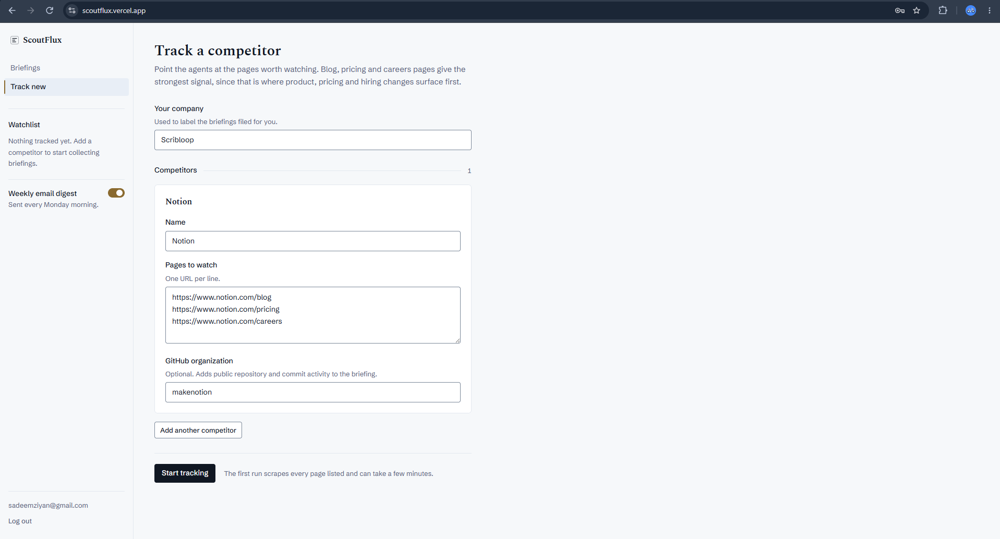
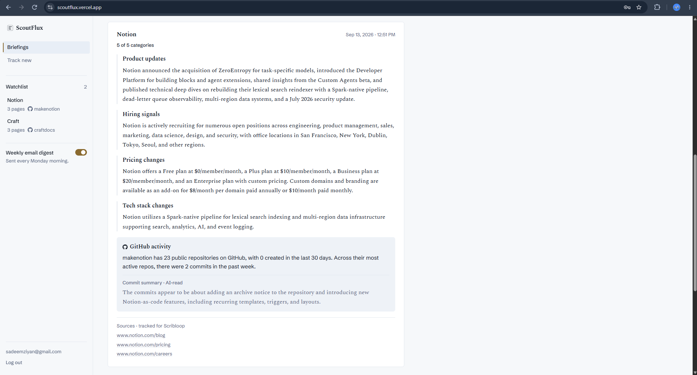
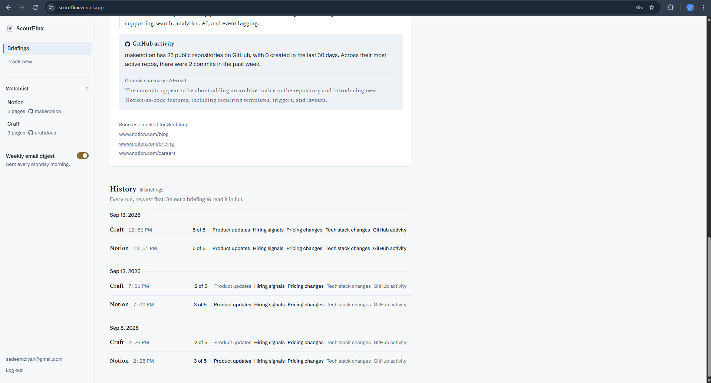
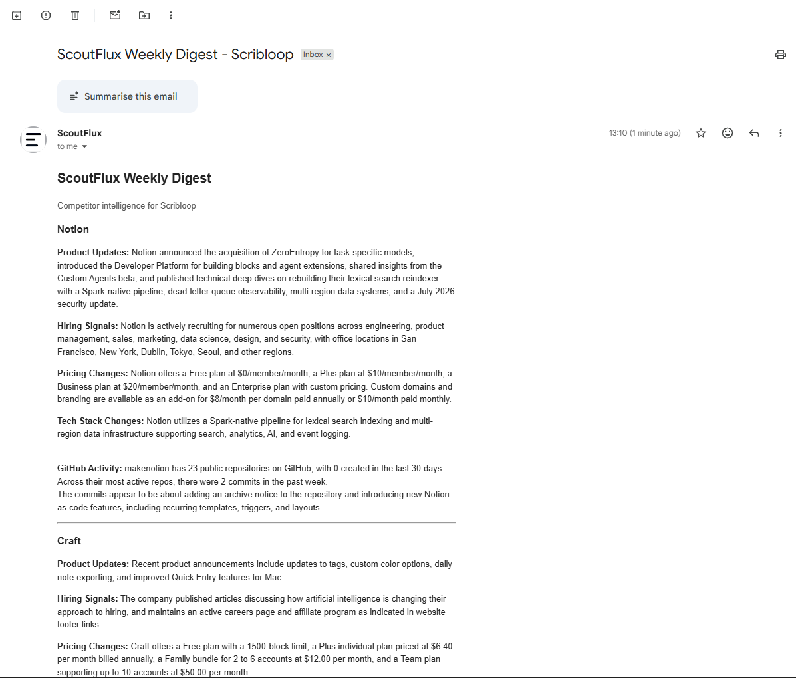
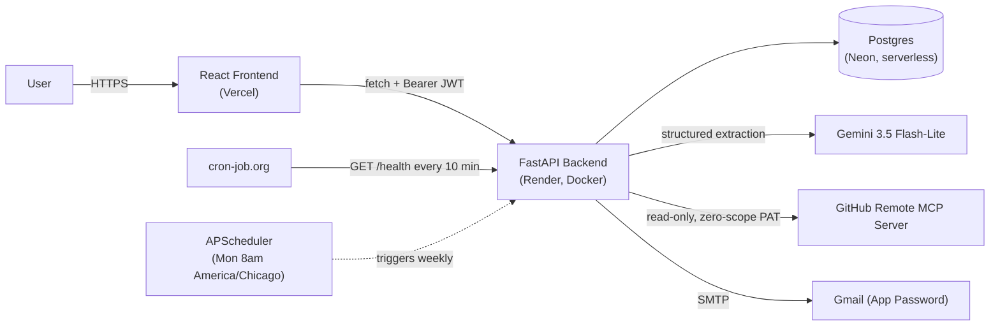
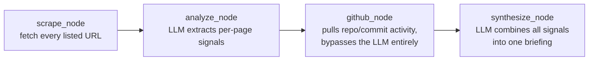

<div align="center">

# ScoutFlux

**Autonomous competitor intelligence, powered by a multi-agent AI pipeline.**

Point it at your competitors' public pages and GitHub orgs. It scrapes, analyzes, and synthesizes
product, hiring, pricing, tech-stack, and open-source signals into a weekly briefing,
automatically, every week, with zero manual triggering after setup.

[**Live App**](https://scoutflux.vercel.app) · [**Repo**](https://github.com/sadeemziyan/ScoutFlux)

🔗 https://scoutflux.vercel.app

</div>

---

## Table of Contents

- [Screenshots](#screenshots)
- [What It Does](#what-it-does)
- [Architecture](#architecture)
- [Tech Stack](#tech-stack)
- [Engineering Decisions & Debugging Stories](#engineering-decisions--debugging-stories)
- [Scraping Ethics](#scraping-ethics)
- [Database Schema](#database-schema)
- [Getting Started](#getting-started)
- [Known Limitations](#known-limitations)
- [Roadmap](#roadmap)
- [License](#license)

---

## Screenshots

**Tracking a competitor:**



**A real briefing, generated from actual scraped pages and live GitHub data:**



**History across multiple real runs over several days:**



**The same briefing, delivered as a weekly email digest:**



---

## What It Does

You give ScoutFlux:
- Your own company name
- A list of competitors, each with specific pages to watch (blog, pricing, careers, whatever
  gives the strongest signal) and, optionally, their GitHub org

Every week (or on demand for the first run), it:

1. **Scrapes** each listed page, respecting robots.txt, an honest user agent, and Cloudflare's
   newer AI-input opt-out signal.
2. **Extracts** structured signals per page with an LLM: product updates, hiring activity,
   pricing changes, tech-stack changes.
3. **Pulls public GitHub activity** for the competitor's org: repo counts, new repos in the last
   30 days, commit volume in the last 7 days, via GitHub's official remote MCP server.
4. **Synthesizes** everything into one briefing per competitor, deduplicated and combined across
   sources.
5. **Emails a digest** (opt-in) summarizing all tracked competitors, and files everything in a
   dashboard with full history.

Five categories are tracked per competitor: **Product Updates, Hiring Signals, Pricing Changes,
Tech Stack Changes, and GitHub Activity.**

---

## Architecture

### System overview



Every ownership-sensitive query filters by `id AND user_id` together. `Depends(get_current_user)`
only proves *identity*, never *ownership* of a specific row unless the query explicitly checks it.
This closes the standard IDOR gap where authentication is mistaken for authorization.

### Agent pipeline (LangGraph, one run per competitor)



`github_node` deliberately does **not** feed GitHub data through the analyzer's LLM call. The
data is already structured from a real API, so asking an LLM to re-extract it would just be a
hallucination surface with no upside. `synthesize_node` still threads it through, but only ever
copies it straight onto the final result rather than asking the LLM to reproduce it.

---

## Tech Stack

### Backend

| Technology | Why |
|---|---|
| FastAPI + SQLAlchemy + Alembic | Core API, ORM, and migrations |
| LangGraph | Multi-agent orchestration, chosen over AutoGen (entered maintenance mode in 2025) and over plain LangChain chains, which don't support the cycles/branching this pipeline needs |
| langchain-mcp-adapters | Connects to GitHub's official remote MCP server |
| Gemini 3.5 Flash-Lite | Powers analysis, synthesis, and commit interpretation. Chosen over standard Flash after its 20-requests/day *shared* cap broke down under realistic scheduled-job plus multi-user load; Flash-Lite's 500/day comfortably covers it |
| Selenium + BeautifulSoup4 | Hybrid static/JS-rendered scraping, decided per domain by directly comparing content length rather than guessing from a fixed threshold |
| APScheduler (3.x) | Weekly automation. 4.x was still alpha with a known deserialization CVE at the time |
| PyJWT + pwdlib (Argon2) | Auth, chosen over `python-jose` and `passlib`, both unmaintained and broken on current Python |
| smtplib (stdlib) | Sends the weekly digest over Gmail SMTP, no third-party email API needed |

### Frontend

| Technology | Why |
|---|---|
| React 19 (plain JavaScript) | TypeScript deliberately skipped to avoid compounding two new-concept learning curves at once |
| Vite | Build tool, chosen over the deprecated `create-react-app` |
| Tailwind CSS v4 | Backs a fully custom design system, see below |
| ESLint | Linting |

### Infrastructure

| Service | Role | Why |
|---|---|---|
| **Vercel** | Frontend hosting | Genuinely free forever on the Hobby tier |
| **Render** (Docker) | Backend hosting | Docker support is required specifically to install Chrome for Selenium; plain Python buildpacks can't do this |
| **Neon** | Serverless Postgres | Free tier doesn't expire, unlike Render's own Postgres add-on |
| **cron-job.org** | Keep-alive ping | Prevents Render's free-tier 15-minute spin-down; chosen after UptimeRobot banned commercial use on its free tier |

A deliberate design note: the app uses **two separate database connection strings**,
`DATABASE_URL` (pooled, used by the running app) and `DATABASE_URL_DIRECT` (unpooled, used only by
Alembic). Per Neon's own documented guidance, PgBouncer's transaction-mode pooling can break
schema-migration DDL, so migrations bypass the pool entirely.

### Frontend design system

The UI went through a full custom design pass rather than using a component library:

- Every button, input, panel, and label comes from one shared set of primitives.
- Color tokens have **computed, documented contrast ratios** (e.g. `ink` at 16.89:1 on canvas,
  AAA text), not eyeballed.
- A deliberate typographic split: **sans-serif for measured/factual data, serif for
  AI-synthesized prose**, so a reader can feel the difference between "the API said this" and
  "the model wrote this" without reading a label.
- A "N of 5 categories found" ledger on every briefing, so "nothing found" is visibly different
  from "not checked."

---

## Engineering Decisions & Debugging Stories

Real issues found and fixed during the build, each verified with an actual test or live API call
rather than assumed from documentation:

- **Three separate real API response-shape mismatches**, found via direct diagnostic scripts
  against live services while building the GitHub integration:
  1. `langchain-mcp-adapters` returns MCP tool results as a list of content blocks
     (`[{"type": "text", "text": "<json>"}]`), not parsed data or even a plain JSON string.
  2. GitHub's `search_repositories` tool returns a **plain-English error message** (not JSON) when
     an org doesn't exist or has no public repos. Confirmed live against a real org with no
     discoverable public presence, and correctly treated as "nothing found," not a failure.
  3. `ChatGoogleGenerativeAI`'s `.content` is usually a string but occasionally comes back as a
     list of content blocks for certain Gemini responses, a documented quirk confirmed via a
     live failure in production logs.

- **A real, live production bug in the digest scheduler**: it was silently running at Sunday
  midnight UTC (no explicit timezone set at all) while the UI told users "sent every Monday
  morning." Found during a deliberate re-verification of the scheduler config against the actual
  UI copy, not assumed correct because it had shipped. Fixed to
  `CronTrigger(day_of_week="mon", hour=8, minute=0, timezone="America/Chicago")`, verified with a
  direct fire-time computation.

- **A real production connection bug**: Neon's free-tier compute auto-suspends after 5 minutes of
  database inactivity, silently killing pooled SQLAlchemy connections and causing intermittent
  500s. Render's own 15-minute *process* spin-down is a separate, independent sleep system,
  and the keep-alive ping only solves that one (it hits `/health`, which never touches the DB), so
  fixing the database side required `pool_pre_ping=True` and `pool_recycle=270` on the engine
  itself.

- **A deliberate architecture call against an earlier plan**: GitHub activity data lives on
  `PageSignals` (sibling to the URL and scraped signals), *not* on the analyzer's own structured
  output schema, even though an earlier draft called for it, specifically to avoid asking an
  LLM to fill in a field its own prompt never mentions on every single real scraped page. A small
  but real hallucination-surface reduction.

- **A real frontend state bug**: newly-tracked competitors didn't appear in the sidebar Watchlist
  until a full page reload. Root cause: the Watchlist fetches once on mount and, unlike the
  Dashboard (which fully remounts on every navigation), stays permanently mounted across the
  session, so it never received a signal that new data existed. Fixed with a `refreshKey` prop
  bumped by the parent on successful submission.

- **Security-minded credential scoping**: the GitHub token used for the MCP integration is a
  classic PAT with **zero scopes checked**, not even `repo`, since it only ever reads public
  data. Reasoned explicitly as reducing blast radius if `.env` ever leaked, rather than defaulting
  to a broader scope "to be safe."

---

## Scraping Ethics

Built in, not bolted on:

- **robots.txt**, fetched with an honest user agent (`ScoutFluxBot/1.0`) and a real timeout.
  Python's `RobotFileParser.read()` is avoided because it silently ignores both. Three distinct
  outcomes, not one blanket rule: a `404` (no robots.txt published) is treated as unrestricted; a
  `401`/`403` (the rules file itself is blocked) is treated as fully disallowed, a stronger
  signal than silence; anything else fails closed.
- **Cloudflare's Content Signals extension** to robots.txt is checked separately, specifically
  whether a site has opted out of `ai-input`, which is exactly what the analyzer does with scraped
  text. This is distinct from the standard `Disallow` rules: a page can be fully fetchable while
  still explicitly opting out of this specific downstream use.
- **Rate limiting** applied between requests to any single domain.
- **Passive-only interaction**: a best-effort click-expansion step reveals accordion/FAQ content
  that's genuinely absent from the DOM until interaction, but deliberately never touches anything
  that could submit a form or navigate away: no `type=submit`, no real `<a href>`. The scraper
  only ever reads.

---

## Database Schema

| Table | Purpose |
|---|---|
| `users` | Accounts: email, hashed password (Argon2), `receive_digest` preference (defaults off) |
| `briefings` | One row per competitor per pipeline run, the historical record, never mutated |
| `tracked_competitors` | Ongoing tracking intent, decoupled from `briefings` on purpose, with no foreign key between them, so removing a tracked competitor never touches history and the weekly job needs no per-competitor cancellation logic |
| `alembic_version` | Migration tracking |

`tracked_competitors` upserts on resubmit are a **full replace, not a merge**. This matches the
form's own UX (one textarea represents the full current state) and is the only way to ever remove
a URL from tracking.

---

## Getting Started

### Prerequisites
- Python 3.12, Node.js, PostgreSQL
- A Gemini API key, a Gmail account with an App Password, and a zero-scope classic GitHub PAT

### Backend

```bash
cd backend
python3 -m venv venv
source venv/bin/activate
pip install -r requirements.txt

cp .env.example .env   # then fill in all 7 variables

alembic upgrade head
uvicorn app.main:app --reload
```

### Frontend

```bash
cd frontend
npm install
echo "VITE_API_URL=http://localhost:8000" > .env
npm run dev
```

---

## Known Limitations

Documented, not hidden:

- **Per-domain rendering strategy assumes a domain's pages are consistently built.** A site
  mixing a static blog with a JS-heavy embedded job board could get miscategorized based on
  whichever page was scraped first for that domain.
- **Scraped pricing can be IP-geolocation-dependent**, a real quirk for a competitor-pricing
  tool, since an apparent "price change" could sometimes just be currency-localization noise.
- **No stable competitor identity**: competitors are matched by free-text name per user, with no
  fuzzy deduplication across sessions.
- **Auth is deliberately scoped down**: no password reset, no email verification, no OAuth, no
  refresh tokens, no login rate-limiting. Built as real, from-scratch auth for its reusable-
  boilerplate learning value, not for feature completeness.
- **The "AI-read" label on GitHub commit summaries depends on an exact string match** between
  backend and frontend to distinguish a real LLM interpretation from the fixed zero-commit
  fallback string. Currently correct, but a soft coupling worth tightening.
- **Rate-limit pacing is a fixed delay, not true retry-with-backoff** on actual `429`/`503`
  responses, sufficient at current scale, flagged for later if usage grows.

---

## Roadmap

- Trend detection across weekly runs
- Slack integration
- Sentiment analysis on scraped content
- Fuzzy competitor-name deduplication

---

## License

MIT

---

<div align="center">

Built by [Sadeem Ziyan](https://github.com/sadeemziyan), CS sophomore, UT Dallas.

</div>